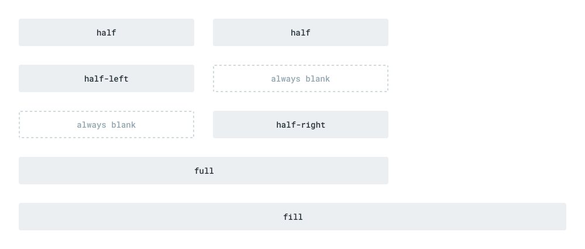

# Fields

> A Field is a specific type of value within a Collection. For example, you might have _Title_, _Body_, _Author_, and _Date Published_ fields within an _Articles_ collection. Each field represents a database column.

## Alias Fields

While Directus is built around the principle of "Database Mirroring", not all fields in Directus map directly to an actual database column within their collection. Some relational fields, like one-to-many ([O2M](/guides/relationships.html#one-to-many)) and many-to-many ([M2M](/guides/relationships.html#many-to-many)), represent data that is stored in different collections. Other fields simply don't save data atall, such as a `divider`. All of these are called "alias" fields, to help clarify that they don't have a mirrored database column.

## Creating Fields

To get started, go to _Settings > Collections & Fields_, choose the Collection you want to add the field to, then click "New Field".

### 1. Choose an Interface

Do you want a Toggle? Text Input? Map? Dropdown? Relationship? There are many Core Interfaces available here, with even more Extension Interfaces available. This is always the first step when creating a new field, and dictates the rest of the process. [Learn more about Interfaces](./interfaces.html)

### 2. Database Options

Only the "Name" is required for this step, but it's good to familiarize yourself with the other options to get the most out of each field.

* **Name** — The actual column name in the database. Automatically sanitized as you type, with letters converted to lowercase, illegal characters removed, and spaces converted to underscores.
* **Default Value** — The default value for this field. Used for new items if the field is left blank.
* **Note** — Optional helper text shown beside the field on the Item Detail page.
* **Required** — Whether or not this field requires a value.
* **Readonly** — Whether or not this field's interface can be updated from the item detail page.
* **Advanced Options**
  * **Field Type** — Directus specific type (eg: `string`, `number`). Limited by what the interface supports.
  * **MySQL Datatype** — Specific database-vendor type used to store data (eg: `VARCHAR`, `INT`).
  * **Length** — Max size of data that can be contained by this field.
  * **Validation** — A RegEx string used to validate the value on save. (eg: `/^[A-Z]+$/`)
  * **Primary Key** — Whether or not this field is the primary key (PK) of the collection.
  * **Unique** — Whether or not this field's value must be unique within the collection.
  * **Hidden Detail** — Hides the field on the Item Detail page.
  * **Hidden Browse** — Hides the field on the Item Browse page.
  * **Translation** — Translates the field name into different locales (doesn't change the database/API)

### 3. Relationship Setup

This step only appears if you selected a relational interface, such as _Many to Many_ or _Translations_. [Learn more about Relationships](/guides/relationships.md).

### 4. Interface Options

Interfaces are highly customizable with options that allow you to tailor them to individual uses. These vary depending on interface complexity, with less-common options hidden within an "Advanced" accordion. In addition to an interface's custom options, _every_ field has a system option for its width. Learn more about this within the Field Layout section below.

## Duplicating Fields

If you are creating multiple fields that are nearly the same, you can choose to duplicate an existing field instead of creating a new one. To do this, click on the context menu on the right side of the field in the listing, and select "Duplicate Field". This will open a modal that lets you choose the name of this new field, and the collection it should belong to.

::: tip
Duplicating a field does not duplicate its content.
:::

## Field Layout

You can change the layout of fields on the Item Detail page to create tailored forms for each collection. Layout is configured through the following settings:

### Field Order

You can use the drag handles on the left of each field to update their order within Directus.

::: tip
Initially, Directus fields mirror the order of their respective database columns. However Directus allows you to manage column order and field order _separately_, since the specific order of columns in the database can be used to optimize query performance.
:::

### Field Width

You can also adjust the width of each field within the Directus Item Detail form. Certain width options wrap differently, so form placement may also be affected (in combination with the field's sort value). The width options are explained visually below.

## Deleting Fields

Click the context menu on the right side of the Fields listing and then select "Delete". This will completely delete the field from the schema as well as any data contained within them. You will only be asked to confirm this action once... then this field and all of its content/config will be permanently deleted.

::: danger
Deleting fields is one of the most dangerous actions you can perform within Directus. It is an irreversible action that can remove vast amounts of data. Please be absolutely sure this is what you want before proceeding.
:::
