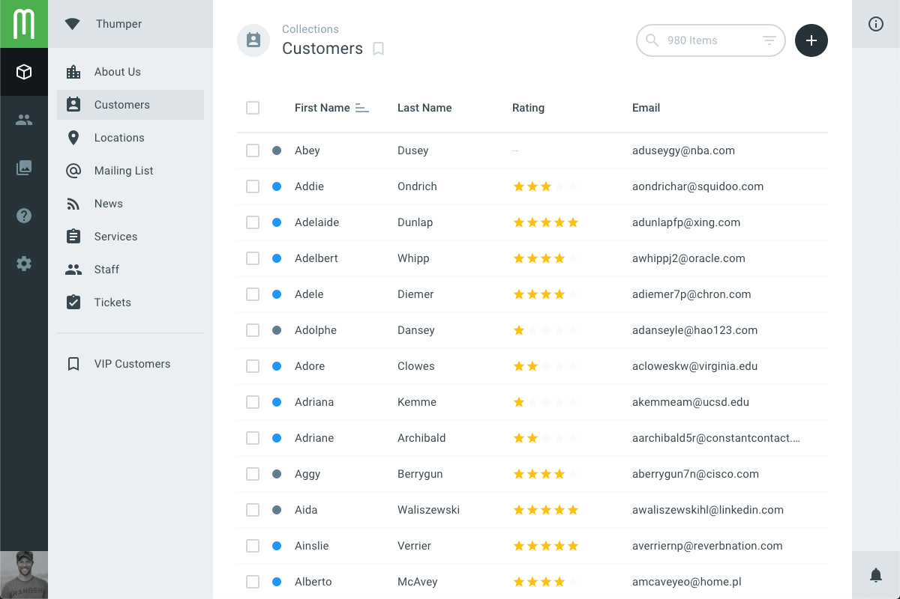
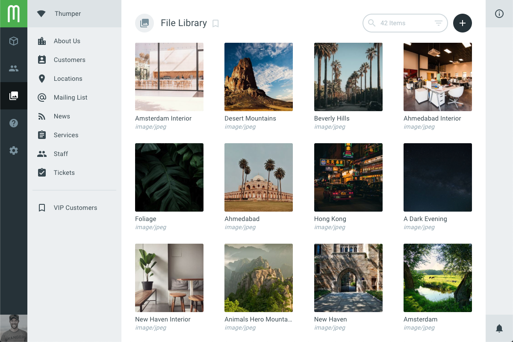
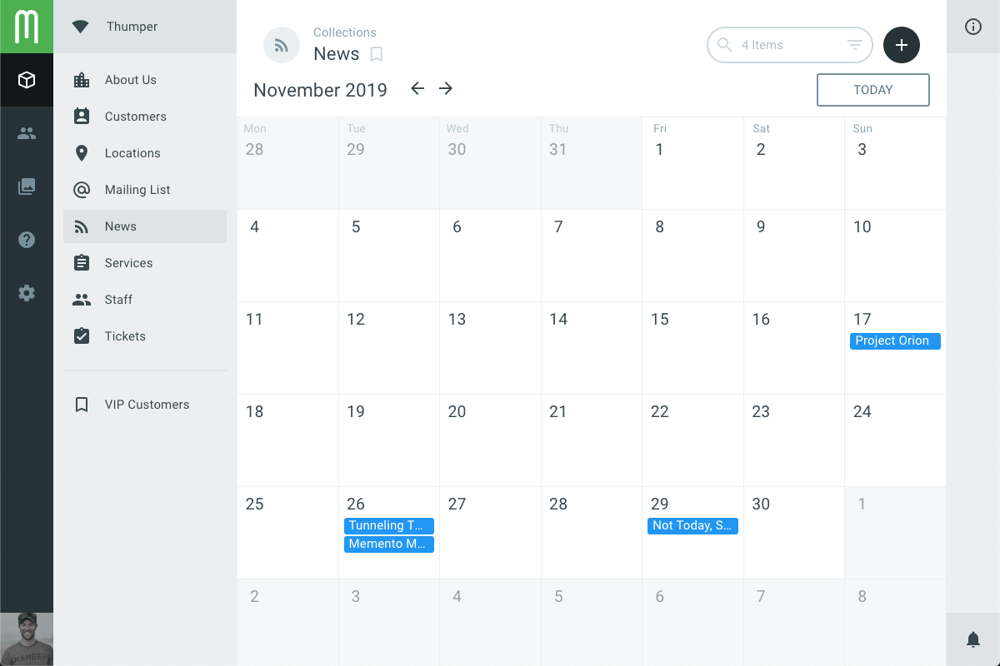
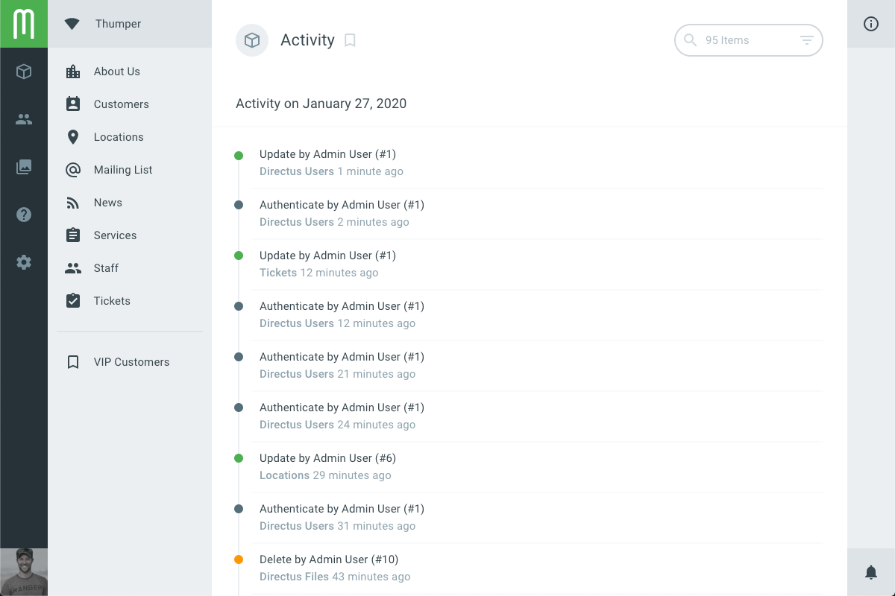

# Layouts

> Layouts are the App's presentation layer for collections. They can be used to browse, visualize, or interact with items at the collection level. Table, Cards, Timeline, Map, Calendar, and Chart are all examples of different layout options.

## Changing Layouts

Clicking on a collection from the nav sidebar will take you to a page where you can view its items. Since it works for all types of data, the "Table" layout is used by default, but users can choose any other layout they prefer. To do so, click to expand the Info Sidebar on the right side of the App. At the top of this expanded sidebar you can click on the dropdown to select a new layout.

## Layout Options

Each layout also includes options used for initial setup and style adjustments. These options are visible in the info sidebar, just below the layout chooser. For example, if you're using the default Table layout you'll see options for which fields are visible, field order, and row spacing.

## Layout Preferences

As you configure your layout and its options, your setup will be saved in your user preferences. Next time you go to that page, even if you log out or use a different computer, you'll still see things the same way.

::: tip Bookmarking Layouts
You can also create multiple layout configurations (including filters), and easily switch between them, by saving them as bookmarks. [Learn More about Bookmarks](./user-guide.html#bookmarking)
:::

## Core Layouts

### Table

Shows data in columns and rows. You can click each column header to sort by that field and drag columns to resize widths as needed. This is the default layout for all collections since you can always use a table to display data.

* **Fields** — Toggle fields on/off and drag them into a new order
* **Spacing** — Changes row density between: Compact (32px), Cozy (40px), and Comfortable (48px)

### Cards

Optimized for collections with images, this layout lets you select a file field that will be shown as a thumbnail, and other fields to be displayed as text below.

* **Sort By** — The field to sort cards by
* **Sort Direction** — The direction for sorting, either ascending or descending
* **Image Source** — The file field to use as the thumbnail
* **Fit** — Whether to crop (always square) or contain (maintain aspect ratio) the thumbnail
* **Title** — The first field to be shown below the the image card
* **Subtitle** — The second (subdued) field to be shown below the the image card
* **Fallback Icon** — An icon to use when an image is not available

### Calendar

Optimized for dates and datetimes, this layout shows items in a monthly overview.

* **Datetime** — A combined datetime field to use for organizing items in the calendar
* **Date** — A date field to be used instead of datetime
* **Time** — An optional time field to be used alongside the Date option
* **Title** — The field used for the title of the item's event
* **Color** — A color field used to show the event as a specific color

### Timeline

Optimized for dates and datetimes, this layout shows items in a linear timeline view by day.

* **Date** — The date or datetime field used to order items
* **Title** — The template string of fields used for the title of the item's event
* **Content** — The field used to show the longer content/description of the event
* **Color** — A color field used to show the event as a specific color

## Extension Layouts

You can also create custom layouts to fit your specific project needs. [Learn more about Layout Extensions](../extensions/layouts.html)
