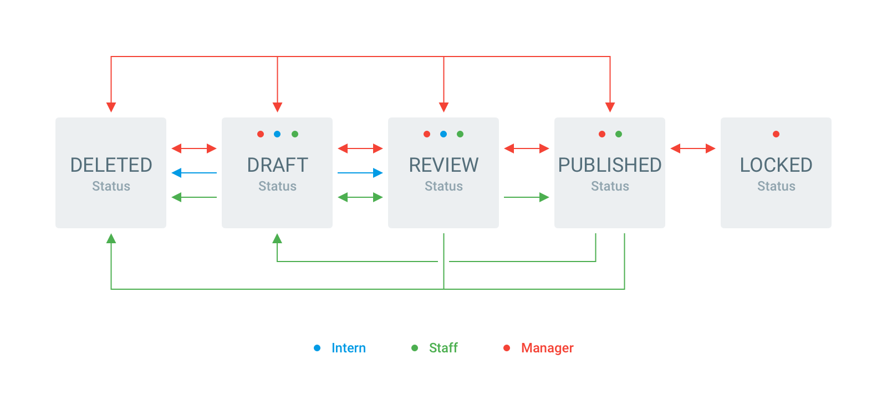

# Permissions

> Directus permissions are extremely granular and powerful, but don't feel overwhelmed, you don't need to use or even understand the more advanced features to setup basic roles.

## Collection Level

Directus supports the standard Create, Read, Update, and Delete (CRUD) permissions, and adds additional support for Comments and Explanations. Furthermore, some privileges have the ability to be scoped to the current user or other their role. Below are all of the collection-level permissions:

### Create

* `none` (or `NULL`, default) Can not create any items
* `full` Can create items

### Read

* `none` (or `NULL`, default) Can not view any items
* `mine` Can only view _their_ items
* `role` Can only view items created by members of this role
* `full` Can view all items

### Update

* `none` (or `NULL`, default) Can not update any items
* `mine` Can only update _their_ items
* `role` Can only update items created by members of this role
* `full` Can update all items

### Delete

* `none` (or `NULL`, default) Can not delete any items
* `mine` Can only delete _their_ items
* `role` Can only delete items created by members of this role
* `full` Can delete all items

### Comment

* `none` Can not comment
* `read` Can only see comments
* `create` Can add comments
* `update` (or `NULL`, default) Can add, edit and delete their comments
* `full` Can add, edit and delete any comments (including other users)

### Explain (Force)

* `none` (or `NULL`, default) Never requires "commit" comment
* `create` Requires a "commit" comment on Create
* `update` Requires a "commit" comment on Update
* `always` Requires a "commit" comment on Create and Update

:::tip NOTE
The `mine` and `role` permission options are only available when the parent collection contains a `created_by` field type. See below for setup.
:::

::: tip Shortcuts
Hover over of each row to access an "All/None" shortcut per collection, or click the column header to toggle that permission for all collections.
:::

::: warning System Permissions
There is a "Directus System Collections" toggle at the bottom of the permissions interface that lets you manage permissions for `directus_files`, `directus_users`, and other system collections. This is important if you are trying to enable access to relational Files or Users.
:::

### Accountability

To enforce the `mine` and `role` permissions described above, Directus needs to know who created an item. Additionally, you may want to track _when_ an item was created, or when it was last _updated_. This can all happen automatically, but you first must include a few system fields.

* **User Created** – Stores the ID of the user who created this item. Setup: Create a field with the `user_created` interface
    * This field is required to use the `mine` and `role` permissions
* **DateTime Created** – Stores the GMT datetime this item was created. Setup: Create a field with the `datetime_created` interface
* **User Updated** – Stores the ID of the last user to update this item. Setup: Create a field with the `user_updated` interface
* **DateTime Updated** – Stores the GMT datetime this item was last updated. Setup: Create a field with the `datetime_updated` interface

::: tip
There are dedicated interfaces available to make it easier to set up the above fields.
:::

## Field Level

Clicking "Fields" allows you to blacklist certain fields for either read and write. This allows you to control which fields are visible or editable within the collection. By default, fields are both readable and writable.

## Status Level

Clicking "Allowed Statuses" allows you to blacklist certain status options. This allows you to control which status options a user can choose – for example, not allowing an Intern to _publish_ items. By default, all statuses are available.

## Workflow

Workflows are one of the most powerful features of Directus, allowing for all permissions to be controlled **per status**. Workflow is enabled by clicking the arrows at the far right to expand the collection into Workflow mode and show dedicated permission rows for each status.

In addition to the custom options set within your status interface, there is always a "On Creation" option that sets permissions for when an item is being created. This is useful because when an item is being created it doesn't yet have a status set.

### Example

This feature enables absolute control over the most fluid workflows, but it can be difficult to fully understand its potential, so let's explore an example with all the bells and whistles:

#### Intern

* **Creating** – Can create Draft or Review items
* **Read** – Can see Draft items they created, Review items anyone in their role created, all Published items, and all Locked items
* **Update** – Can only update their Drafts. Can save their drafts to Review, but once submitted they can no longer be edited
* **Delete** – Can only delete their Drafts items
* **Explain** – Must leave an explanation when creating/updating Draft or Review items
* **Comment** – Can comment on their Draft items or Review items created by members of their role

#### Staff

* **Creating** – Can create Draft, Review, or Published items
* **Read** – Can see all Draft, Review, Published, and Locked items
* **Update** – Can update all Drafts, Review, and Published items. Published items can only be updated to Draft (not Review)
* **Delete** – Can only delete any Drafts or Review items, and can Delete their Published items
* **Explain** – Must leave an explanation when creating/updating Published items
* **Comment** – Can comment on any Draft, Review, or Published items

#### Manager

* **Creating** – Can create Draft, Review, Published, or Locked items
* **Read** – Can see all Draft, Review, Published, and Locked items
* **Update** – Can update all Drafts, Review, Published, and Locked items. Status can only be updated linearly
* **Delete** – Can delete any items except Locked
* **Explain** – Does not need to explain creations or updates
* **Comment** – Can comment on any item

#### Administrator

Not shown in the diagram, but worth noting: the Admin role always has _full_ permissions and is not required to explain anything.

## App Level

Below the permissions interface is a toggle to show the Directus system collections. These permissions are automatically generated when new roles are created and can be used to control certain system pages, such as: File Library, User Directory, and My Activity.

::: warning
Changing the default system permissions can result in unexpected behavior or a completely broken platform. The API and App rely on certain data. For example, full read permission for `directus_users` is required. Only update these values if you know exactly what you're doing.
:::

## IP Level

You can also control access to Directus based on a user's IP address. This is useful if you need to limit access to specific offices or locations, provided they have a static IP address. Simply add a CSV of IP addresses to limit, or leave blank to not limit.
