# Relationships

> If certain collections within your project are related then you can connect them with Relationships. There are multiple types of relationships but technically Directus only needs to store one: the **Many-to-One**.

## Many-to-One

A many-to-one (M2O) relationship exists when an item of **Collection A** is linked to one single item of **Collection B**, but an item of **Collection B** may be linked to many items of **Collection A**. For example, a movie has one director, but directors have many movies.

### Setup

 

<video width="100%" autoplay muted controls loop>
  <source src="../img/video/m2o.mp4" type="video/mp4">
</video>

This setup is specific to the `movies → directors` (M2O) field. The following steps assume you already have two collections: `movies` and `directors`. Each collection has the default `id` primary key and a `name` field.

::: v-pre
1. Go to **Settings > Collections & Fields > Movies**
2. Click **New Field**
3. Interface: Choose **Many-to-One**
4. Schema: **Name** your field (we're using `director`)
5. Relation: Select **Directors** as the Related Collection
6. Options: Enter a **Dropdown Template** (we're using `{{name}}`)
    * This can be any [MicroMustache](https://www.npmjs.com/package/micromustache) string containing field names available within `directors`
:::

:::tip Matching MySQL Datatype
In this example the `directors` collection uses the default `id` primary key, which has a Database DataType of `INT`. If you're using a different primary key type, such as `STRING`, make sure that your relational field's DataType/Length matches that of the primary key it will store. This can be adjusted under "Advanced Options" in the Field Modal.
:::

#### Screenshots

Both dropdowns under "This Collection" are disabled since those refer to the field we're configuring now. The Related Field is also disabled since it must be the collection's Primary Key. All you need to do is choose which collection you want to relate to... in this case: `directors`.

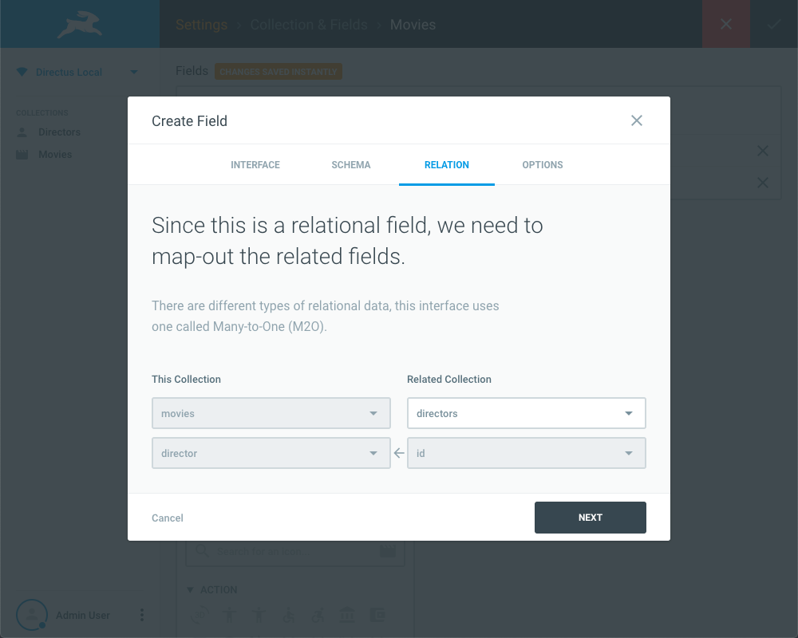

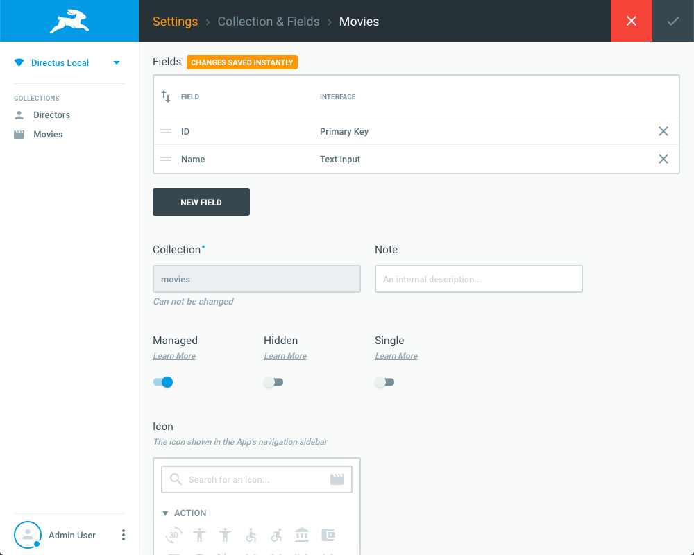
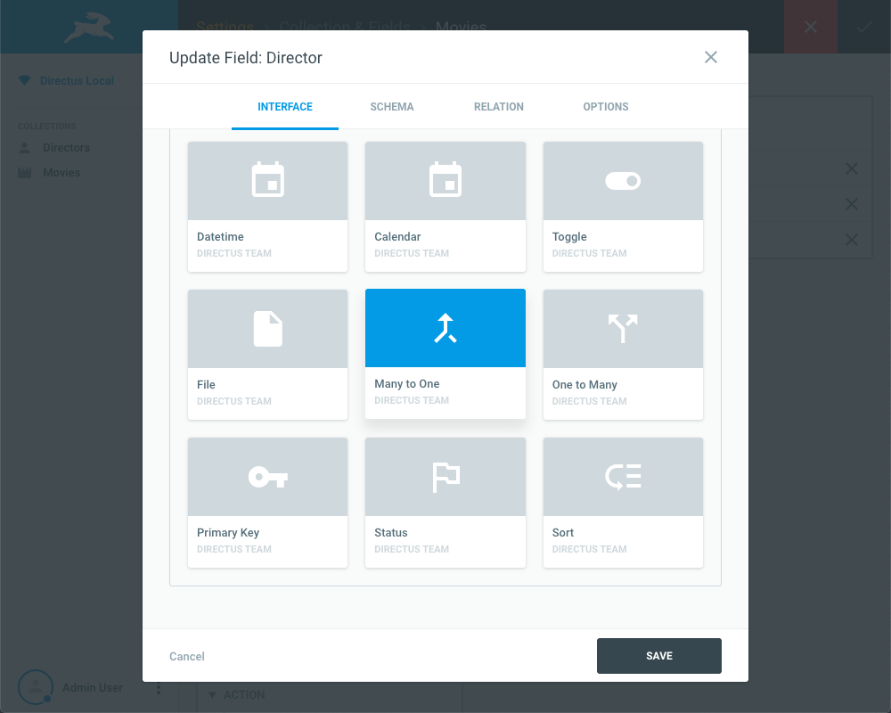
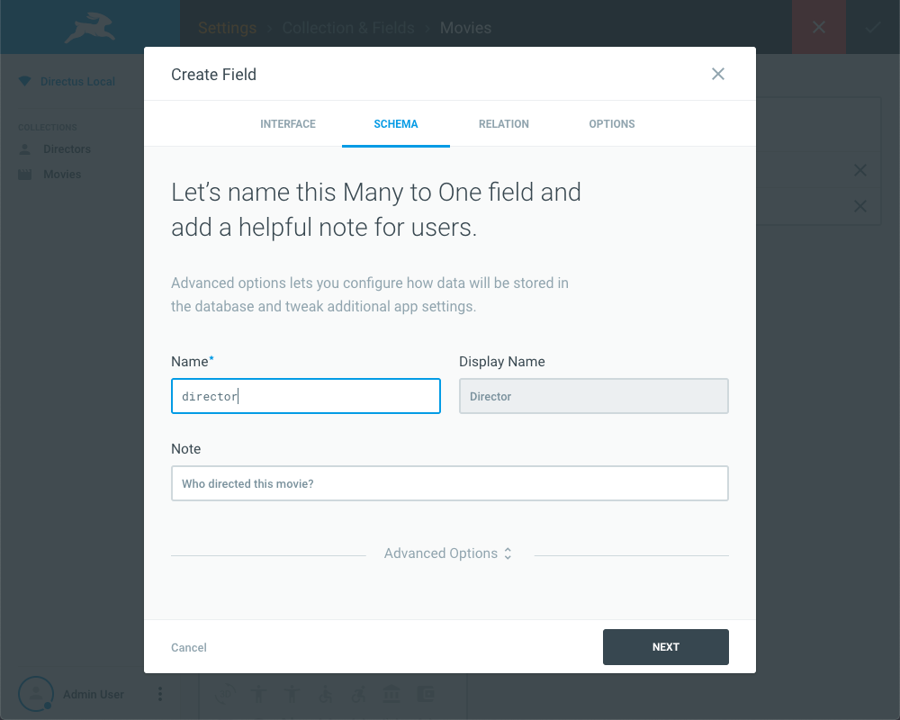

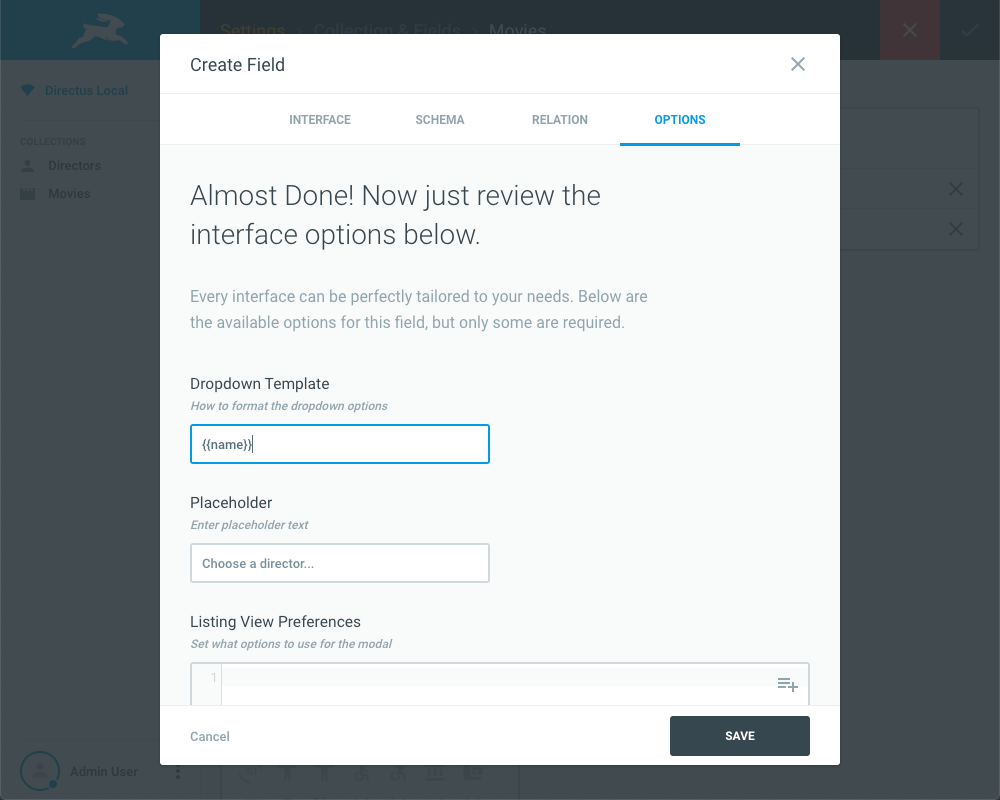
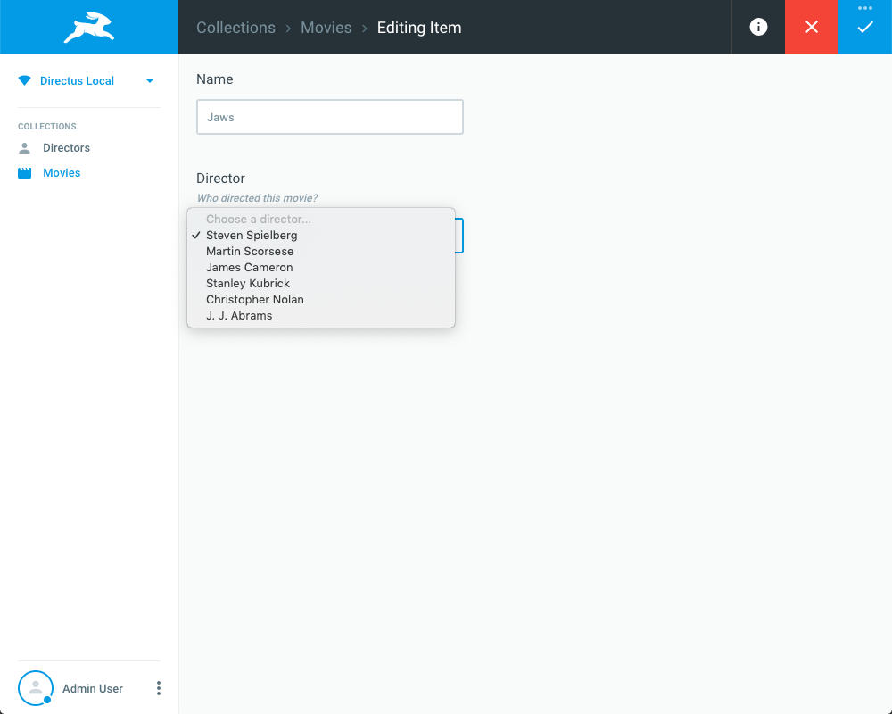

## One-to-Many

A one-to-many (O2M) relationship exists when an item of **Collection A** may be linked to many items of **Collection B**, but an item of **Collection B** is linked to only one single item of **Collection A**. For example, directors have many movies, but a movie only has one director. As you can see, this is the _same relationship_ as the M2O above... but looking at it from the opposite direction.

### Setup

This setup is specific to the `directors → movies` (O2M) field. The following steps assume you already have two collections: `movies` and `directors`. Each collection has the default `id` primary key and a `name` field. Additionally, we're assuming you have already created the M2O relationship above, which creates the `movies.director` field.

::: v-pre
1. Go to **Settings > Collections & Fields > Directors**
2. Click **New Field**
3. Interface: Choose **One-to-Many**
4. Schema: **Name** your field (we're using `movies`)
5. Relation: Select **Movies** as the Related Collection and **Director** as the Related Field
    * The `movie.director` field was created during M2O setup above
:::

:::tip Alias Fields
Technically, this process does not create a new field, it remotely manages the relational data using the `movies.director` field. So if you were to look in the database you would not see an actual `directors.movies` column. That is why we call this an "alias", because it simply _represents_ a field.
:::

#### Screenshots

Both dropdowns under "This Collection" are disabled since those refer to the field we're configuring now. First, choose the Related Collection, in this case `movies`. Once that is selected the Field dropdown will update to show the allowed options and you can choose the field that will store the foreign key in the related collection. In this example, `movies.director` will store `director.id` so we choose `director`.

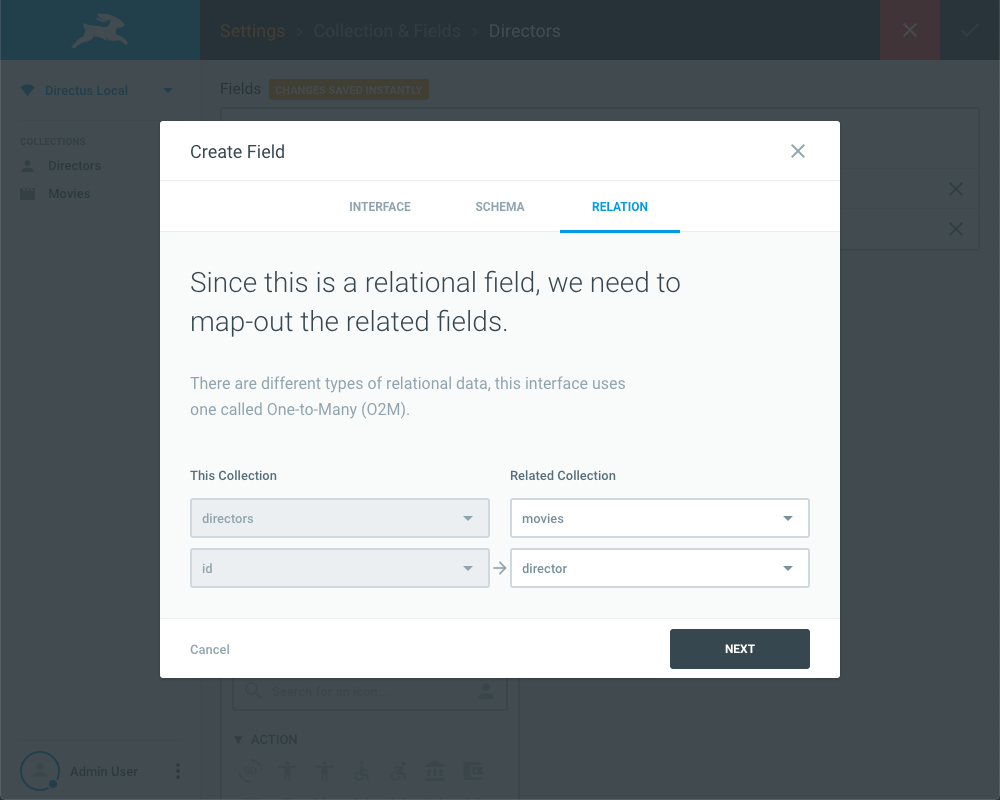

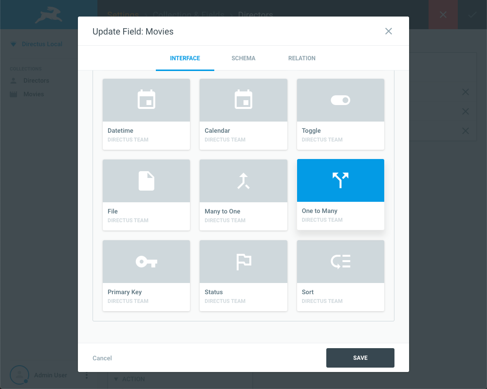
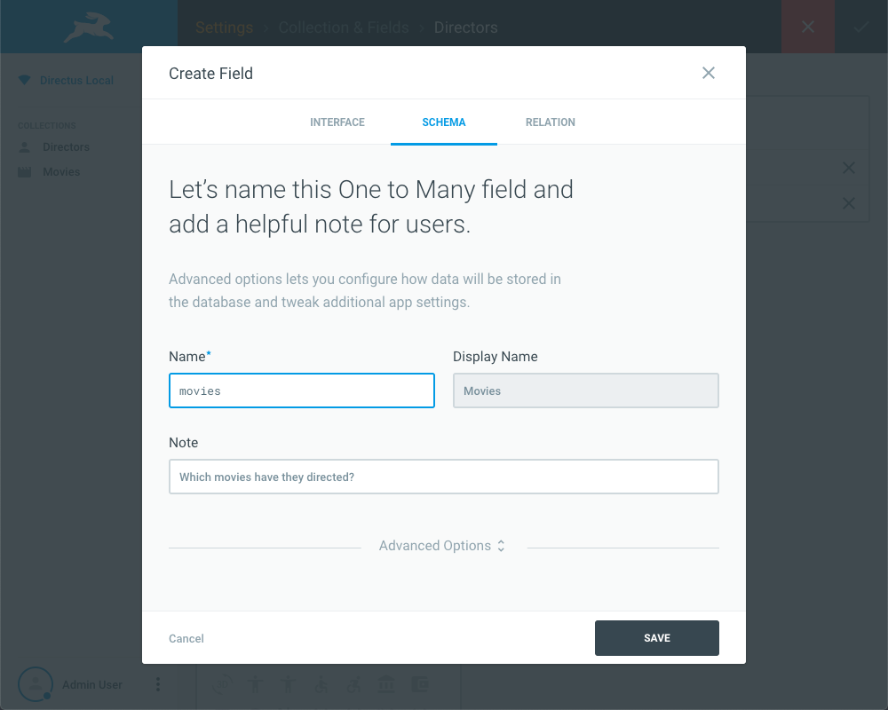

 <!-- done -->

## Direction Matters

Now we understand that a M2O and O2M are the _exact_ same relationship... just viewed from opposite directions. The `movies` form shows a M2O dropdown to choose the director, and the `directors` form has a O2M listing to select their movies. But if you were to peek behind the scenes you would only see one entry in `directus_relations` defining this duplex relationship.

:::tip
An easy way to remember which side is which: the "many" is an actual column that stores the foreign key, while the "one" side is a simulated column using the `ALIAS` datatype.
:::

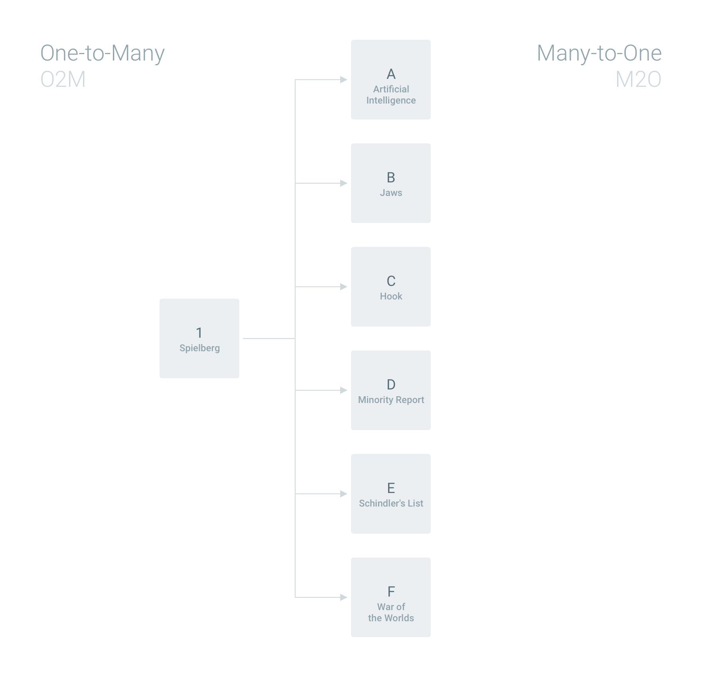

## One-to-One

Directus does not have a specific one-to-one (O2O) relationship type or interface. However a O2O saves data the same way as a M2O (storing a foreign key) — the only difference is how you _enforce_ the cardinality. By default, the M2O allows you to create multiple relationships in one direction, but it can become a O2O by adding an event hook (`item.create:before` and `item.update:before`) or a custom interface that checks/constrains uniqueness.

## Many-to-Many

A many-to-many (M2M) is a slightly more advanced relationship that allows you to link _any_ items within **Collection A** and **Collection B**. For example, movies can have many genres, and genres can have many movies.

Technically this is not a new relationship type, it is a O2M and M2O _working together_ across a "junction" collection. Each item in the junction (eg: `movie_genres`) is a single link between one item in `movies` and one item in `genres`.

### Setup

This setup is specific to the `movies → genres` (M2M) field. The following steps assume you already have two collections: `movies` and `genres`. Each collection has the default `id` primary key and a `name` field.

::: v-pre
1. Go to **Settings > Collections & Fields**
2. Click **New Collection**
3. **Name** your junction collection (we're using `movie_genres`)
4. Set the junction collection to be _Hidden_ (Optional)
5. Click **New Field** — Add `movie_genres.movie` (basic numeric type)
6. Click **New Field** — Add `movie_genres.genre` (basic numeric type)
7. Go to **Settings > Collections & Fields > Movies**
8. Click **New Field**
9. Interface: Choose **Many-to-Many**
10. Schema: **Name** your field (we're using `genres`)
11. Relation: Select **Genres** as the Related Collection
    * Select **Movie Genres** as the Junction Collection
    * Map `movies.id` to **Movie** under the junction
    * Map `genres.id` to **Genre** under the junction
12. Options: **Visible Columns** sets the columns the interface shows (we're using `name`)
    * **Display Template** sets the columns the interface shows (we're using `{{movie.name}}`)
:::

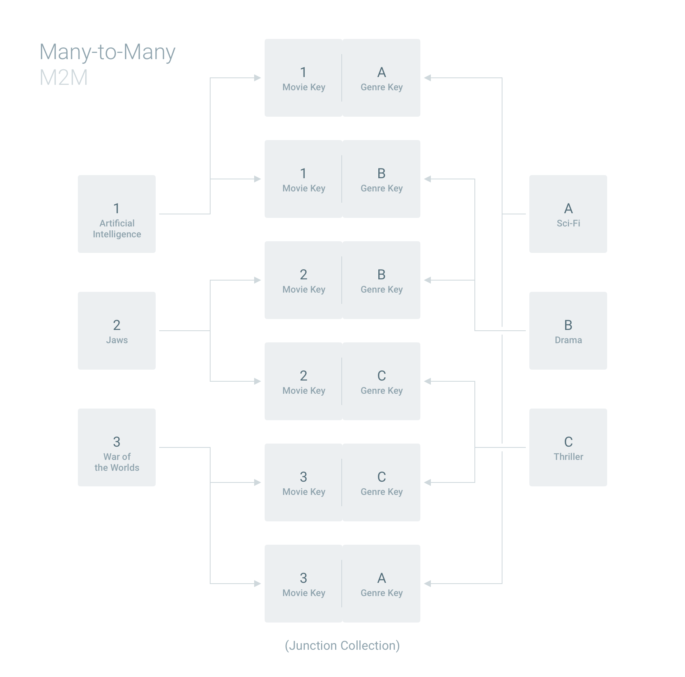

#### Screenshots

Both dropdowns under "This Collection" are disabled since those refer to the field we're configuring now. The Related Field is also disabled since it must be the collection's Primary Key. First, choose the collection you want to relate to. Now select a junction collection and connect its keys by following the arrows.

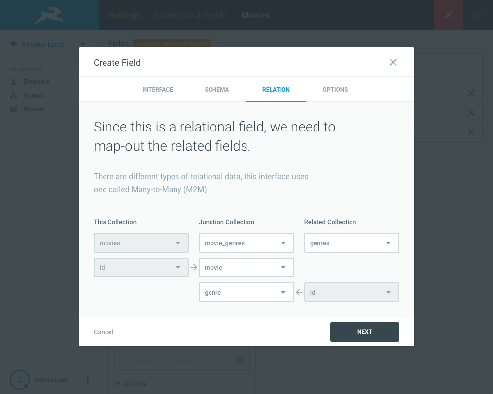

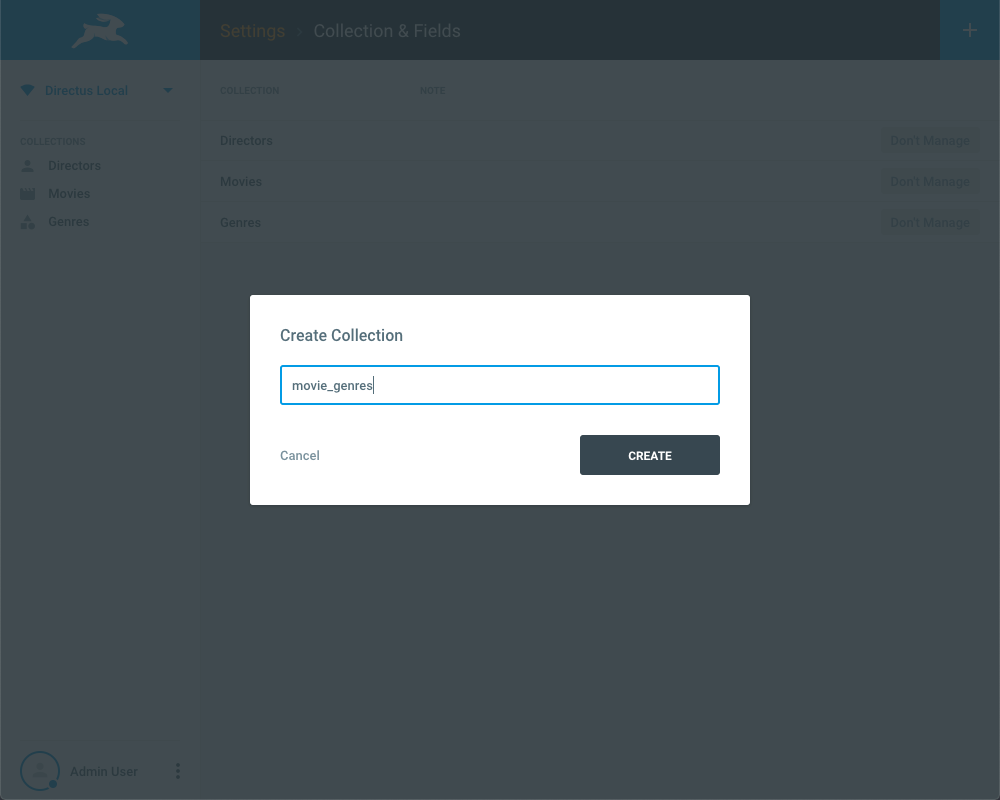
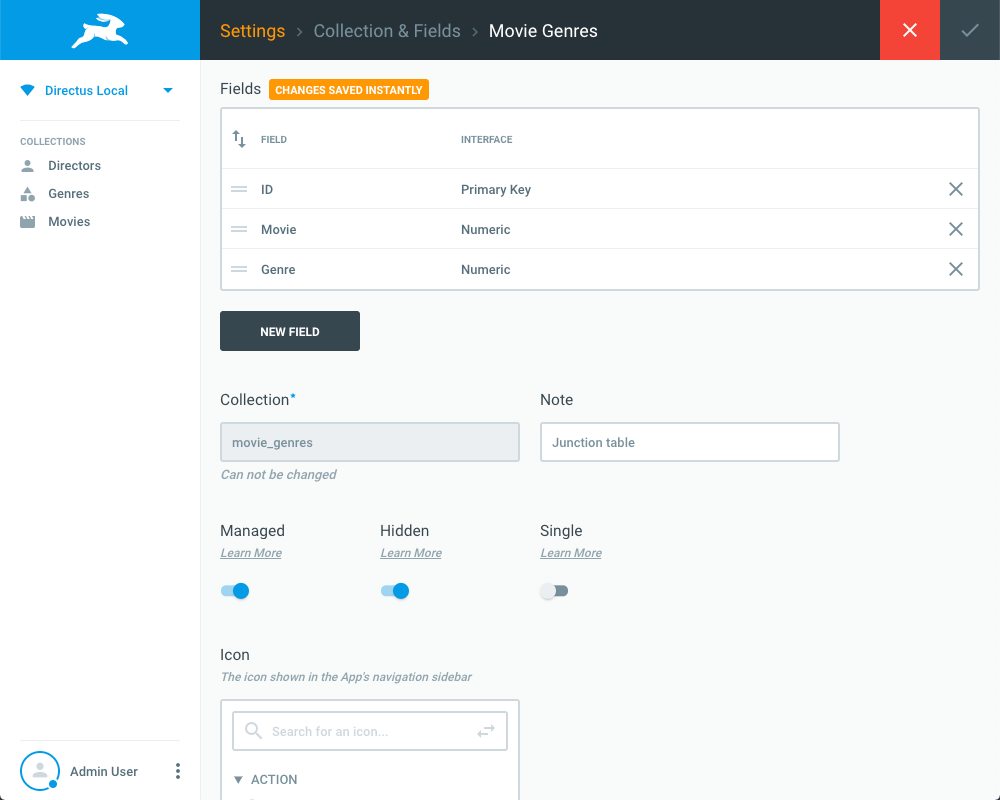
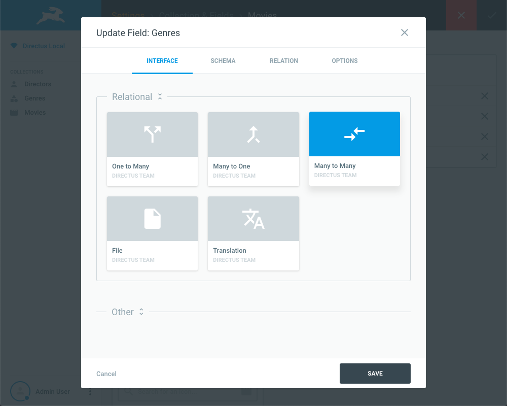

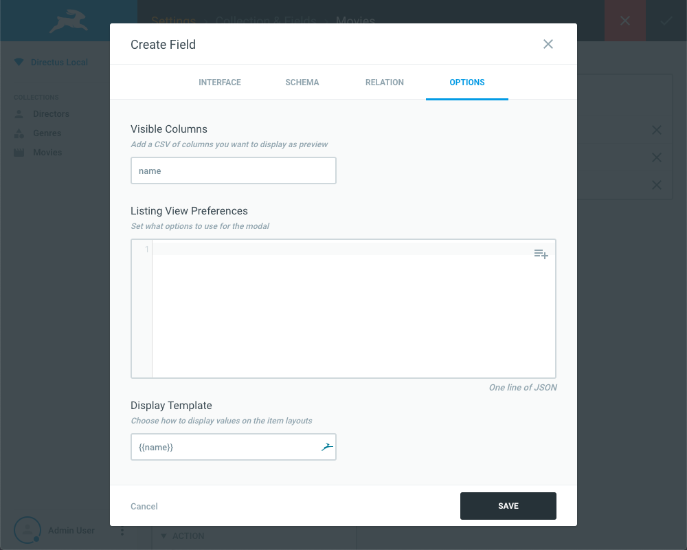
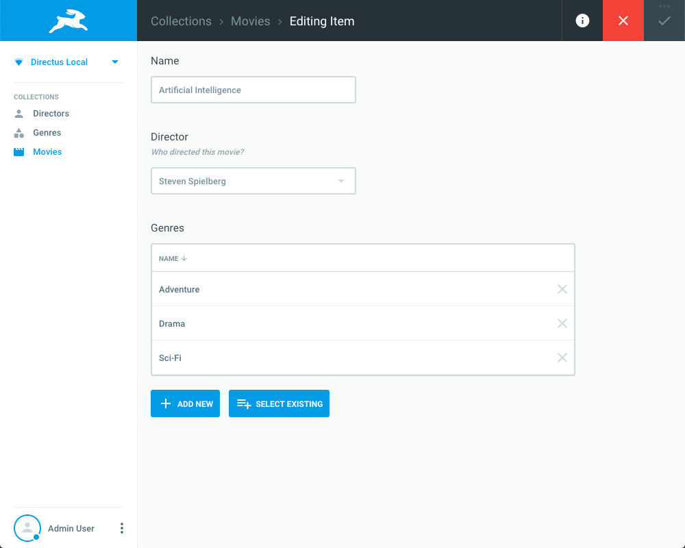

:::tip Relation Arrows
During relationship setup the App shows arrows between each field to help visualize the data model. *Each arrow points from the primary key field to the foreign key field.*
:::

## Many-to-Any

The many-to-any (M2X) allows you to connect items within **Collection A** to many items from **any collection**. It is essentially the same as a M2M, but requires connected collections to use a Universally Unique Identifier (UUID) for the primary key. The Directus relational architecture supports this type of relationship, but there is no dedicated M2X interface yet.

This type of relationship goes by many different names, and is often referred to by its specific purpose. Some names include: matrix field, replicator, M2MM, M2X, M2N, etc.

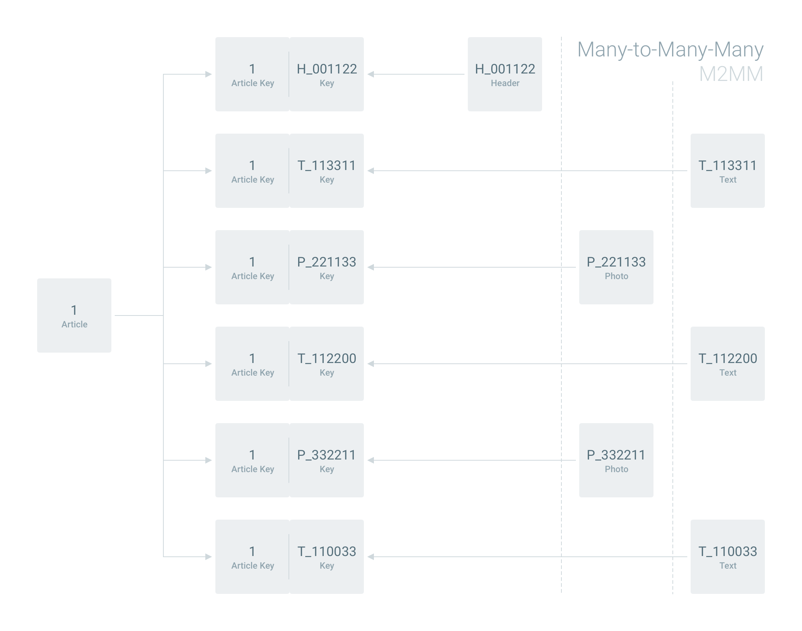

## Translations

The translation interface is a standard O2M relation, but it requires an additional field in the related collection to hold the language key. Let's take a look at some example collections and fields for "Articles":

* `articles` — The parent collection
  * `id` — The article's primary key
  * `publish_date` — Example agnostic field
  * `translations` — This is the ALIAS field (not an actual column) we're setting-up
* `article_translations` — The translations collection
  * `id` — The translation's primary key
  * `article` — Stores the article's primary key: `article.id`
  * `language` — Stores the language key, eg: `en-US`
  * `title` — Example translated field
  * `body` — Example translated field

### The Parent Collection

In this example, the parent collection stores articles, so we've called it `articles`. It contains a primary key, as well as any language-agnostic (non-translated) fields, such as: _Publish Date_, _Author_, or a _Featured Toggle_. We also add the "translation field" (actually an ALIAS) to this collection... which is what we're learning to set up here.

### The Translations Collection

We also need to create a related collection to store any fields that will be translated, such as the _Title_ and _Body_. We'll call this `article_translations`. Below we describe the required fields for this collection.

* **Parent Foreign Key** — This is the field that stores the parent item's primary key. So in our example we would add an `article` field to store the article's ID. Typically we'd use a "Primary Key" interface, and set it to "Hide on Detail".
* **Language Foreign Key** — This is the field that stores the language code. We recommend calling this field `language`. Typically we'd use a "Language" interface with a `lang` type, and set it to "Hide on Detail". We also recommend setting the option "Limit to Directus Availability".
* **One or More Translated Fields** — Now just add any fields that you would like to use for translated content. In our "Articles" example this might be a `title` field as a Text Input, a `body` field as a WYSIWYG, or anything else you want translated.

### The Translation Field Setup

Once you've set up both the parent and translation collections (eg: `articles` and `article_translations`), you can follow these steps to setup the translations interface.

::: v-pre
1. Go to **Settings > Collections & Fields > Articles**
2. Click **New Field**
3. Interface: Choose **Translation**
4. Schema: **Name** your field (we're calling ours "translations")
5. Relation: Maps the relationship between the parent and translations
    * Select **Article Translations** as the Related Collection
    * Select **Article** as the Related Field
12. Options:
    * **Language Field** is the name of the field within the Translation Collection (eg: "language")
    * **Languages** is where you set the languages that can be translated. The key should be a language code (eg: `en-US`), and the name should be the human readable version (eg: `English`). You can add as many languages as you'd like.
    * **Display Template** is a string format for how to display the value on item listing pages and layouts. This should include templated fields from the Translations Collection, such as: `{{title}} — {{summary}}`.
:::
