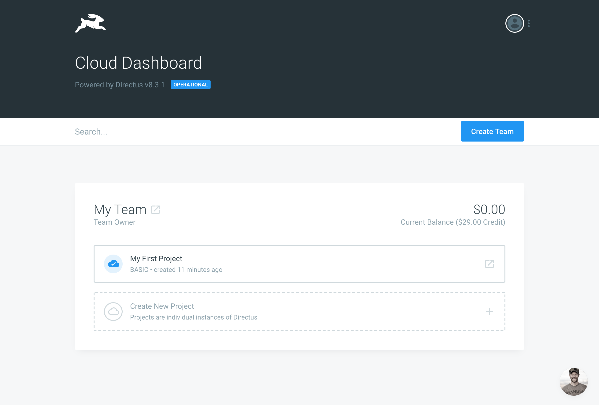

# Directus Cloud

If you'd rather not setup and manage your Directus installation yourself, you can also use Directus Cloud.

Directus Cloud offers the easiest setup as well as automatic updates, backups, guaranteed uptime, unified billing, and premium support.

[[toc]]

## Step 1: Create a Directus Cloud account

Go to [dashboard.directus.cloud/register](https://dashboard.directus.cloud/register) and sign up for an account.

## Step 2: Create a new team

Teams are a shared group of users that all have rights to change the projects within. You can invite multiple members into your team. All projects in a team are billed on the team level.

## Step 3: Create a project

This is the individual instance of Directus.
