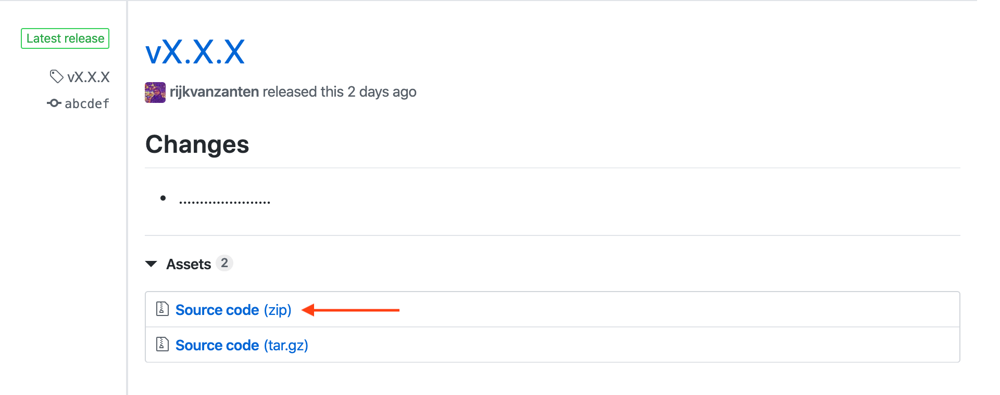

# Installing by manual upload (FTP)

This method of installing is less than ideal, as you'll be in charge of replacing the correct files in order to update the platform.

::: warning Shared hosts
If you're trying to install and use Directus on a shared host, please read the notes on shared hosts below the instructions.
:::

[[toc]]

## Step 1: Make sure requirements are met

Directus requires PHP and MySQL to run properly. That means that a wide variety of webservers, operating systems, and versions are able to run Directus. That being said, we can't promise that Directus will run smoothly in every possible combination of environments. Therefore, we only _officially_ support LAMP stacks.

| Software | Minimum version |
|----------|-----------------|
| Linux    | Ubuntu 18.04    |
| Apache   | 2.4             |
| MySQL    | 5.7+            |
| PHP      | 7.2+            |

::: tip PHP Extensions
The following PHP extensions (typically enabled by default) are also required: `pdo`, `mysql`, `curl`, `gd`, `fileinfo`, `mbstring`, and `xml`.
:::

::: tip MariaDB
While not officially supported, users have reported success installing Directus on MariaDB 10.2+.
:::

::: warning HTTPS
You are required to run Directus using HTTPS.
:::

## Step 2: Download a copy of Directus

Head over to [the releases page of Directus](https://github.com/directus/directus/releases) and download a copy of the source code by clicking "Source code (zip)" under Assets.



## Step 3: Unzip and upload the source files to your server

Upload the files to `/var/www/directus`. This path is not required, but is used in the following steps. If you use another path, make sure to follow that in steps below.

## Step 4: Configure Apache

### Enable mod_rewrite

Run the following command:

```
a2enmod rewrite
```

### Point Apache to Directus' public folder

Make sure the `DocumentRoot` in your Apache configration points to the `public` folder in Directus, located at `/var/www/directus/public`. You can use the following Apache config as a starting point:

```apacheconf
<VirtualHost *:80>
        ServerAdmin webmaster@localhost
        DocumentRoot /var/www/directus/public

        <Directory /var/www/directus/public/>
            Options Indexes FollowSymLinks
            AllowOverride All
            Require all granted
        </Directory>

        ErrorLog ${APACHE_LOG_DIR}/error.log
        CustomLog ${APACHE_LOG_DIR}/access.log combined

        <IfModule mod_dir.c>
            DirectoryIndex index.php index.pl index.cgi index.html index.xhtml index.htm
        </IfModule>
</VirtualHost>
```

On most servers, the default Apache configuration file is located at `/etc/apache2/sites-available/000-default.conf`. If you're planning on hosting multiple projects on this server, we recommend setting up separate Virtual Hosts for each project. To learn more about that, we recommend reading this article: [How To Set Up Apache Virtual Hosts on Ubuntu 16.04](https://www.digitalocean.com/community/tutorials/how-to-set-up-apache-virtual-hosts-on-ubuntu-16-04).

::: tip
Don't forget to restart Apache after making any changes to its configuration!
:::

## Step 5: Set read / write permissions

Directus needs to be able to write to a certain number of places, mainly the `logs`, `public`, and `config` directories. Make sure that your PHP user is able to read and write to these locations.

On most LAMP stacks, you can change the owner of the files to `www-data` to ensure the correct permissions are met:

```
sudo chown -R www-data:www-data /var/www/directus
```

## Step 6: Setup a database and user in MySQL

While you can technically use the `root` MySQL user for Directus, we strongly recommend creating a separate user that only has access to the database that Directus will use.

To learn how to do this, we recommend the following article: [How To Create a New User and Grant Permissions in MySQL](https://www.digitalocean.com/community/tutorials/how-to-create-a-new-user-and-grant-permissions-in-mysql).

## Step 7: Install your first project

Open Directus in the browser. It should take you straight to the installation wizard. If you were following along with the steps above, Directus will be located at `http://<ip-address>/`.

## A Note on Shared Hosts

If you're using a shared host without direct server access, you'll have two things to take into account:

#### You won't be able to set a domain for Directus

Most shared hosts serve whatever is in your folder structure. That means that Directus will most likely run under `http://<domain>/directus/public/`. You can not change this.

#### Private files might be publicly accessible

Normally, we'd instruct you to set the document root to the `public` folder of Directus. This makes sure files that are meant to stay private will never be accessible over the internet. There is no such guarantee when using a shared host with a different document root. Please make sure to prevent unauthorized access to the `config` and `logs` folder in whatever way is possible through your shared host.

::: warning Troubleshooting
If you run into any issues with the above steps, please follow our [troubleshooting guide](/getting-started/troubleshooting.md).
:::